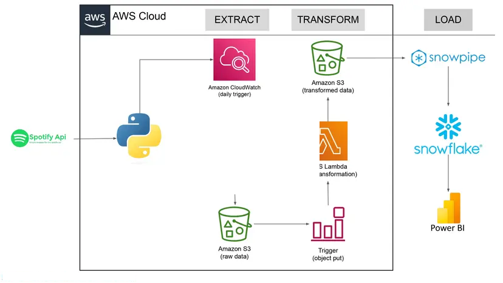

# Spotify ETL Pipeline

*An automated end-to-end data pipeline for Spotify analytics.*

## Overview
This project is an end-to-end ETL (Extract, Transform, Load) pipeline that pulls Spotify data (e.g., albums, tracks) via the Spotify API, processes it using AWS Lambda and S3, and loads it into Snowflake for analytics—all fully automated with CloudWatch and Snowpipe. Built to showcase data engineering skills with real-world tools and workflows.

### Features
- **Extract**: Fetches real-time Spotify data using Python and the Spotify API.  
- **Transform**: Cleans and structures data with AWS Lambda.  
- **Load**: Ingests transformed data into Snowflake via Snowpipe.  
- **Automation**: Runs hourly with CloudWatch triggers and S3 event-driven Snowpipe.

## Architecture
  

1. **Spotify API**: Python script pulls raw data (e.g., album details).  
2. **AWS S3**: Stores raw JSON (`raw_data/`) and transformed CSV (`transformed_data/`).  
3. **AWS Lambda**: Extracts data → S3, then transforms it → S3.  
4. **AWS CloudWatch**: Triggers Lambda hourly.  
5. **Snowflake Snowpipe**: Auto-loads transformed CSV into `staging.album_table`.

## Tech Stack
- **Python**: `spotipy`, `pandas` for API calls and data handling.  
- **AWS**:  
  - **Lambda**: Serverless extract/transform.  
  - **S3**: Storage   
  - **CloudWatch**: Automation trigger.  
- **Snowflake**: Data warehouse with Snowpipe for ingestion.

## Setup Instructions

### Prerequisites
- **Spotify API**: Get a Client ID and Secret from [Spotify Developer Dashboard](https://developer.spotify.com/).  
- **AWS Account**: Set up IAM roles, S3 bucket, and Lambda functions.  
- **Snowflake Account**: Configured with a warehouse and database (e.g., `SNOWFLAKE_ETL_PIPELINE`).

### AWS Setup
1. **S3 Bucket**:  
   - Create `s3://snowflake-spotify-etl-ziggy/` with two folders:  
     - `raw_data/`: Stores raw JSON from Spotify API.  
     - `transformed_data/`: Stores processed CSV files.  

2. **IAM Role**:  
   - **Policy**: Grant S3 read/write permissions:  
     ```json
     {
       "Effect": "Allow",
       "Action": ["s3:GetObject", "s3:PutObject"],
       "Resource": "arn:aws:s3:::snowflake-spotify-etl-ziggy/*"
     }
     ```
   - **Trust**: Assign to Lambda execution role.  

3. **Lambda Functions**:  
   - **`extract_lambda.py`**: Pulls Spotify data and uploads to `raw_data/`.  
   - **`transform_lambda.py`**: Processes raw data and saves to `transformed_data/`.  
   - **Deploy**: Zip each script (`zip extract_lambda.zip extract_lambda.py`) and upload via AWS Console.  

4. **CloudWatch**:  
   - Set up an Event Rule to trigger `extract_lambda` hourly:  
     - Schedule: `cron(0 * * * ? *)` (every hour).  
     - Target: `extract_lambda`.  

## How It Works
1. **Extract**:  
   - `extract_lambda.py` queries the Spotify API (e.g., albums, tracks) and saves raw JSON to `s3://snowflake-spotify-etl-ziggy/raw_data/spotify_2025-03-20.json`.  

2. **Transform**:  
   - `transform_lambda.py` reads from `raw_data/`, cleans and structures the data (e.g., deduplicates albums), and writes to `s3://snowflake-spotify-etl-ziggy/transformed_data/spotify_clean_2025-03-20.csv`.  

3. **Load**:  
   - Snowpipe detects new CSV files in `transformed_data/` via S3 events and loads them into Snowflake’s `staging.album_table`.  

**Sample Data**:  
| album_id | album_name    | release_date |
|----------|---------------|--------------|
| 123      | Dark Side     | 1973-03-01   |
| 456      | Thriller      | 1982-11-30   |

## Contributing
**Pull requests welcome! Fork, tweak, and submit—let’s make it better.**

# Thank you!
